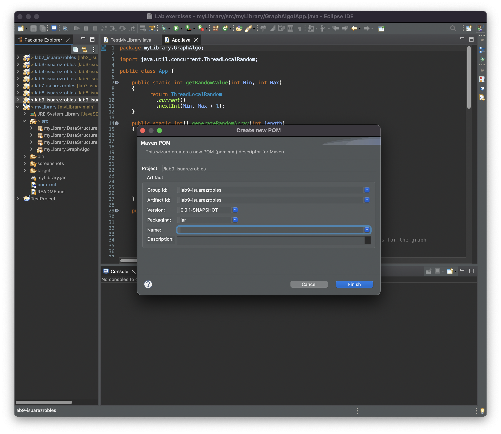
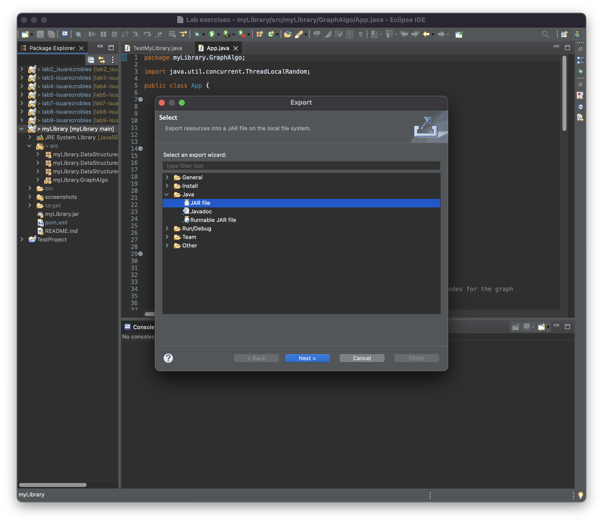
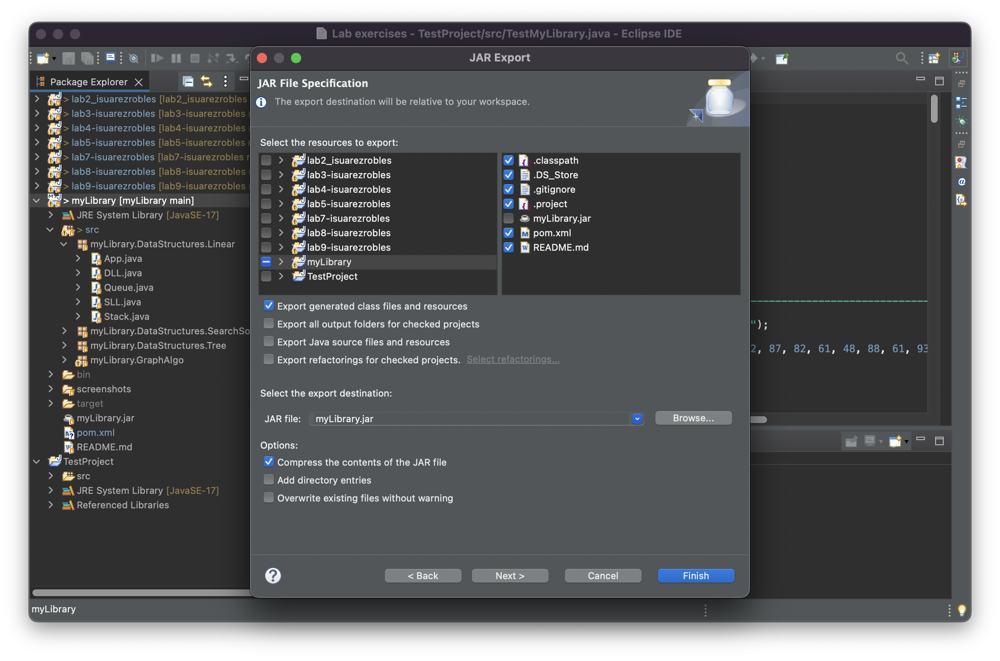
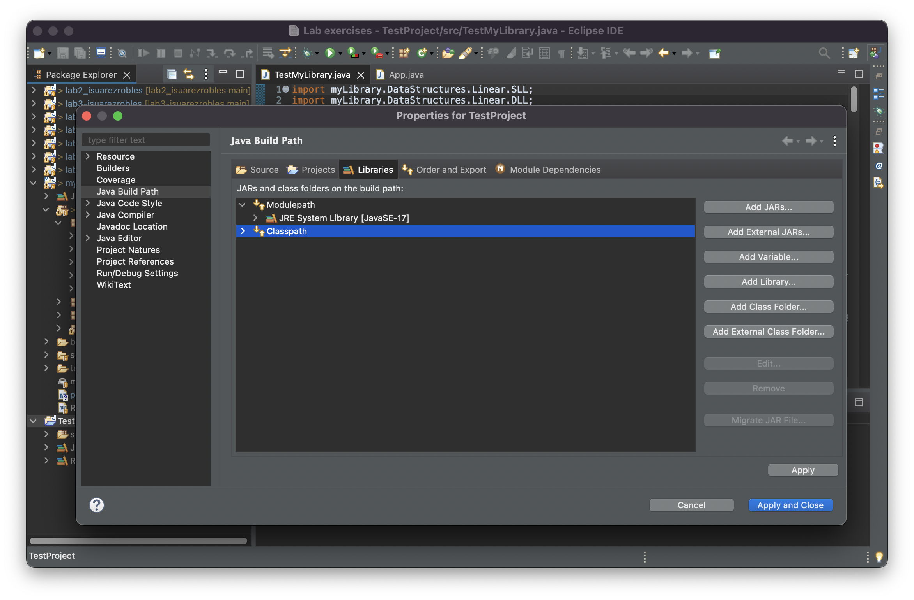
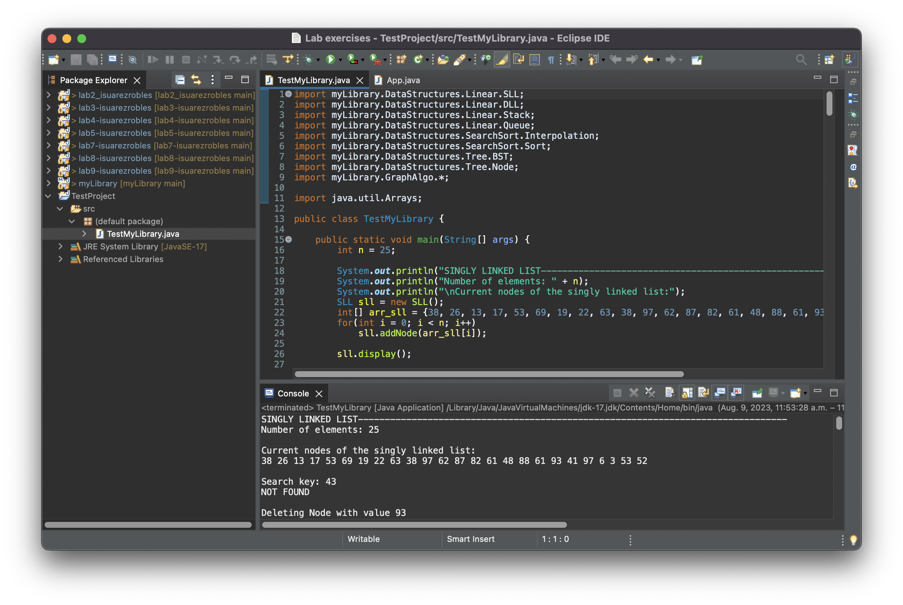

# ElipseJar

author: Israel Robles\
about: please consider these are the steps that work for me on Mac OS, they might not work for you.

### How to convert Java project to Maven project

1. right click on your Project
2. click on Configure > Convert to Maven Project
4. on the Create new POM prompt you can leave everything as it is or specify a name, then click Finish

### How to export (generate a JAR file) your project

1. right click on your Project
2. click on Export
3. on the Export prompt select Java > JAR file and click Next
   

   
5. on the JAR Export prompt select your project and select the files within.
   Make sure Export generated class files and resources and Compress the contects of the JAR file are checked
6. click browse and select in your computer the folder where you want your JAR file imported
7. click Finish 

### How to import your library (JAR file) into any project

1. right click on any Java Project
2. click on Build Path > Configure Build Path
3. on the Properties Prompt select Libraries and click on Classpath
   Note: Classpath is basically where your project will look for any external libraries you add.
4. Click on Add External JARs, browse for you JAR file and click Open
5. Finally click on Apply and Close
   Note: right on, your library has been imported, now you can use the method within as any other built-in library

### Example of using your imported library

On top of your .java import your packagename.additionalFoldersIfAny.className

